# 📐 Wiki: Arquitectura 'Diamond Tier' — TerrorSquadAI [v1.0.4]

Estructura técnica del motor de orquestación de banda mantenido por **DarckRovert**.

## 🏗️ Jerarquía del Sistema de Inteligencia (Data Hierarchy)

TerrorSquadAI opera mediante la interceptación de eventos de banda y la orquestación de red:

1.  **Hueso del Scanner (`Core.lua`)**: Escucha eventos de combate y posicionamiento de los miembros de la raid.
2.  **Motor de Decisión Táctica (`Modules/`)**: Módulos específicos para cada jefe que analizan mecánicas y sugieren marcas.
3.  **Módulo de Sincronización (`Commands.lua`)**: Canal de comunicación para la orquestación de marcas y alertas entre miembros.
4.  **Interface Renderer (`RaidMark_Analysis/`)**: Visualizador de auditoría de mecánicas y rendimiento de banda.

---

## 🧭 Diagrama de Flujo: Orquestación Táctica v9.4

```mermaid
graph TD
    A[Evento de Banda: Daño/Skill de Jefe] --> B[Escaneo de Entorno Core.lua]
    B --> C[Análisis de Patrones en Módulos]
    C --> D{¿Mecánica Crítica?}
    D -- Sí --> E[Modo de Alerta / Marcas de CC]
    D -- No --> Z[Esperar Siguiente Evento]
    E --> F[Inyección en Canal de Banda Commands.lua]
    F --> G[Recepción en Miembros del Séquito]
    G --> H[Render de Alertas con Throttling 0.25s]
    H --> I[Sincronización con WCS_Brain y TerrorMeter]
```

## ⚡ Estrategias de Ingeniería Diamond Tier

- **Collective Parsing**: El sistema solo decodifica eventos relevantes para la mecánica del jefe activo, ignorando el spam de combate menor.
- **Sync Throtling**: Las marcas tácticas se envían con un límite de frecuencia para evitar el spam y la saturación del cliente 1.12.1.
- **Neutral Sync Integration**: Los datos de rendimiento de banda se integran con el ecosistema Gravity para análisis táctico global.

---
© 2026 **DarckRovert** — El Séquito del Terror.
*Orquestando la victoria a través de la inteligencia artificial.*

