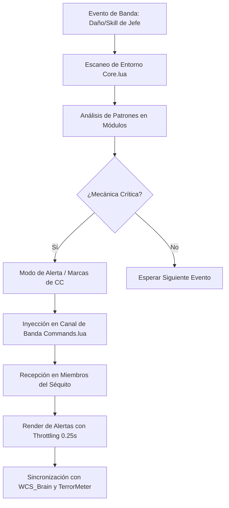

# 📐 Wiki: Arquitectura 'Diamond Tier' — TerrorSquadAI [v9.4.0]

Estructura técnica del motor de orquestación de banda mantenido por **DarckRovert**.

## 🏗️ Jerarquía del Sistema de Inteligencia (Data Hierarchy)

TerrorSquadAI opera mediante la interceptación de eventos de banda y la orquestación de red:

1.  **Hueso del Scanner (`Core.lua`)**: Escucha eventos de combate y posicionamiento de los miembros de la raid.
2.  **Motor de Decisión Táctica (`Modules/`)**: Módulos específicos para cada jefe que analizan mecánicas y sugieren marcas.
3.  **Módulo de Sincronización (`Commands.lua`)**: Canal de comunicación para la orquestación de marcas y alertas entre miembros.
4.  **Interface Renderer (`RaidMark_Analysis/`)**: Visualizador de auditoría de mecánicas y rendimiento de banda.

---

## 🧭 Diagrama de Flujo: Orquestación Táctica v9.4

## ⚡ Estrategias de Ingeniería Diamond Tier

- **Collective Parsing**: El sistema solo decodifica eventos relevantes para la mecánica del jefe activo, ignorando el spam de combate menor.
- **Sync Throtling**: Las marcas tácticas se envían con un límite de frecuencia para evitar el spam y la saturación del cliente 1.12.1.
- **Neutral Sync Integration**: Los datos de rendimiento de banda se integran con el ecosistema Gravity para análisis táctico global.

---
© 2026 **DarckRovert** — El Séquito del Terror.
*Orquestando la victoria a través de la inteligencia artificial.*
